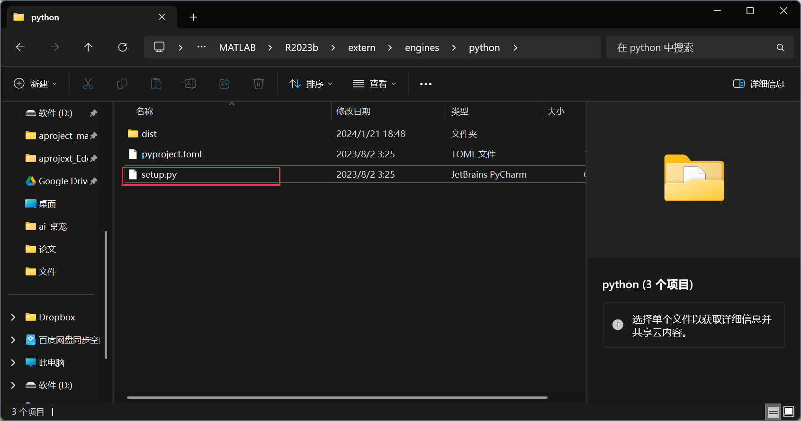

# 一、在matlab中找到一下目录


在cmd输入下面的命令

```sh
cd C:\Program Files\MATLAB\R2023b\extern\engines\python
python setup.py install
```

# 二、为jupyter安装matlab内核

```sh
pip install matlab_kernel  
python -m matlab_kernel install
```

# 三、加入matlab engine

在cmd中输入python

再输入

```sh
import matlab.engine

engine = matlab.engine.start_matlab()

engine.test(nargout=0)

```

完成上面的步骤以后重新打开cmd,在cmd输入jupyter notebook

或者在vscode中选择jupyter内核


